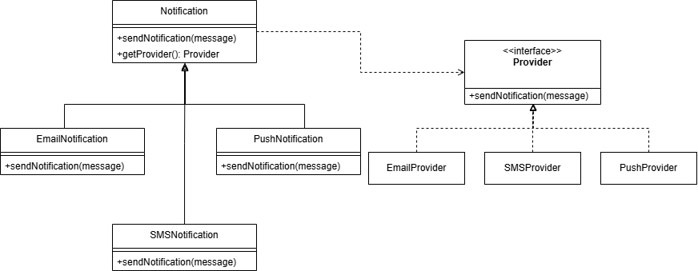

# Design Patterns

## [Factory Method](https://refactoring.guru/design-patterns/factory-method)

### Caso de Uso: Sistema de Notificaciones
    Contexto
    Una empresa de software está desarrollando un sistema de notificaciones que puede enviar alertas a los usuarios a través de diferentes canales, como correo electrónico, SMS y notificaciones push.
    Dependiendo del tipo de usuario y la configuración, la notificación debe enviarse por uno o más de estos canales.
    
    Requisitos

    Flexibilidad: 
    El sistema debe ser fácilmente extensible para soportar nuevos tipos de notificaciones sin modificar el código existente.
    Configuración Dinámica: El tipo de notificación a enviar se debe decidir en tiempo de ejecución, dependiendo de las preferencias del usuario.
    
    Mantenibilidad: 
    El código debe ser fácil de mantener y seguir los principios de SOLID.

#### Solución
    
    Se crea la interfaz provider para declarar las operaciones que pueden realizar los provedores de notificaciones

    Además, para cumplir con el caso de enviar la notificación por uno o más canales dependiendo del tipo de usuario se crea un json de configuración para indicar dinamicamente los proveedores que se pueden aplicar para cada tipo de usuario(esto tambien se podria realizar con un MAP estatico o incluso en un DB)
    Ejemplo de configuración:
    
`
{
"configurations": [
{
"userType": "BASIC",
"notifications": [
"EMAIL"
]
},
{
"userType": "MEDIUM",
"notifications": [
"EMAIL",
"SMS"
]
},
{
"userType": "ADVANCED",
"notifications": [
"EMAIL",
"SMS",
"PUSH"
]
}
]
}
`

